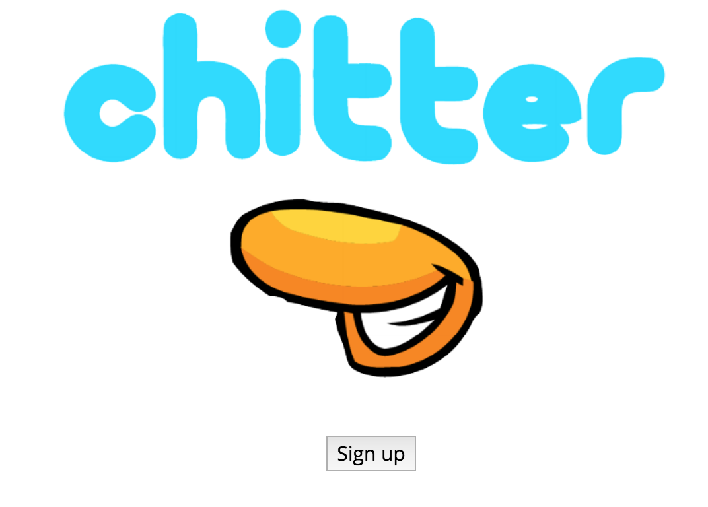

# Introduction
### This project is one of the Maker's Academy weekend challenges. Build a Twitter clone(kind of) CRUD app.

# User stories:
-------

```

As a Maker
So that I can let people know what I am doing  
I want to post a message (peep) to chitter

As a maker
So that I can see what others are saying  
I want to see all peeps in reverse chronological order

As a Maker
So that I can better appreciate the context of a peep
I want to see the time at which it was made

As a Maker
So that I can post messages on Chitter as me
I want to sign up for Chitter

```

## Technologies used:

Sinatra (MVC framework)
PostgreSQL (database)
HTML / CSS (view)

## Database setup:
- Connect to psql
- Create the database using the psql command CREATE DATABASE chitter;
- Repeat for the database chitter_test 
- Connect to the database using the pqsl command \c chitter;
- Run both queries saved in './db/migrations/' in order to set up the peeps and users tables

## How to run the program:
- Clone this repository
```
https://github.com/dangroze/chitter.git
```
- Open terminal, go to the file location
- Run bundle install
- Type in: rackup -p 9999
- Open browser, go to page: localhost:9999

## How to test
- Type in: rspec



